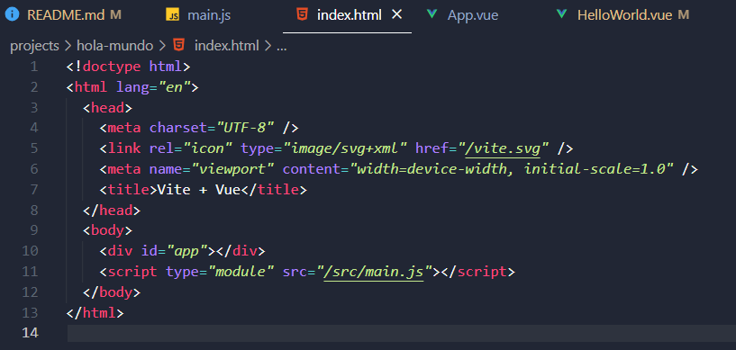
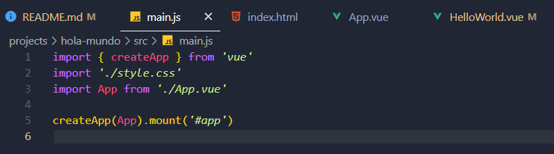
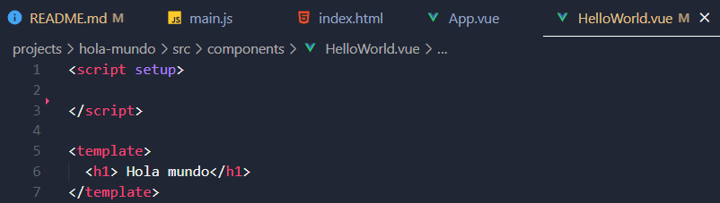
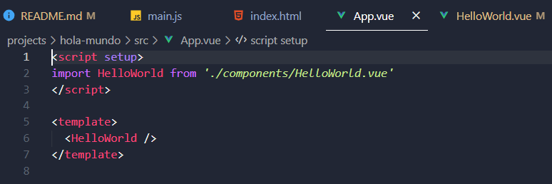
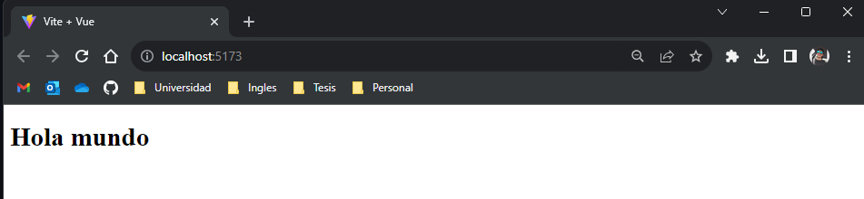

# Vue
Repositorio de Vue
# Introducción al Desarrollo de SPA con Vue

El desarrollo de Aplicaciones de Página Única (SPA) ha revolucionado la forma en que las aplicaciones web se construyen y entregan. En este ensayo, exploraremos cómo Vue.js, un framework de JavaScript progresivo, se utiliza en el desarrollo de SPAs. Las SPAs ofrecen una experiencia de usuario sin interrupciones al cargar una sola página inicial y actualizar el contenido de manera dinámica a medida que los usuarios interactúan con la aplicación.

## ¿Qué es una SPA?

Una Aplicación de Página Única (SPA) es un tipo de aplicación web que carga una sola página inicial y luego actualiza el contenido en esa página de manera dinámica a medida que los usuarios interactúan con la aplicación. En lugar de cargar páginas web completas, las SPAs permiten a los usuarios cambiar entre secciones y vistas dentro de la misma página, lo que crea una experiencia de usuario más rápida y fluida.

## Vue: Historia y Contexto

Vue.js, por otro lado, tiene una historia más reciente en comparación con React. Fue creado por Evan You y lanzado en 2014. La motivación detrás de Vue era proporcionar una biblioteca que fuera fácil de aprender y de usar, sin sacrificar la capacidad de crear aplicaciones web de alta calidad. Aunque comenzó como un proyecto personal, Vue rápidamente ganó adeptos y comenzó a ser adoptado en la industria. Una de las ventajas clave de Vue es su enfoque progresivo, lo que significa que se puede integrar de manera gradual en proyectos existentes. Esto facilita la adopción de Vue para desarrolladores y equipos que desean modernizar sus aplicaciones sin realizar una reconstrucción completa. A lo largo de los años, Vue ha mantenido un crecimiento constante y ha ganado una comunidad activa de desarrolladores y un ecosistema próspero de complementos y herramientas. Su simplicidad y capacidad para escalar de manera efectiva han hecho que Vue sea una opción atractiva para una variedad de proyectos web.

## Características Clave de Vue

- **Component-Based:** Al igual que React, Vue se basa en componentes reutilizables que promueven la modularidad y el mantenimiento del código.
- **Directivas:** Vue utiliza directivas para enlazar datos y controlar el comportamiento del DOM de manera declarativa, lo que simplifica la manipulación del DOM.
- **Reactividad:** Vue ofrece una reactividad efectiva, lo que significa que los cambios en los datos se reflejan automáticamente en la interfaz de usuario sin necesidad de manipulación manual del DOM.
- **Simplicidad:** Vue es conocido por su facilidad de aprendizaje y uso, lo que lo hace atractivo para principiantes y proyectos de desarrollo rápidos.
- **Integración Progresiva:** Vue se puede integrar de manera gradual en proyectos existentes, lo que facilita la adopción gradual.

## Arquitectura de Vue

Vue presenta una arquitectura que se asemeja a la arquitectura MVVM (Model-View-ViewModel), que separa claramente la lógica de presentación de la lógica de negocio. Vue proporciona un flujo de datos unidireccional similar a React, lo que facilita el seguimiento de las actualizaciones y la depuración.

**Model-View-ViewModel (MVVM):** Vue.js se inspira en el patrón MVVM para organizar las aplicaciones de una manera estructurada y mantenible. Aquí está una descomposición de los componentes principales en esta arquitectura:

- **Modelo (Model):** Representa los datos y la lógica de negocio de la aplicación. Los modelos son responsables de recuperar y gestionar los datos, y a menudo se comunican con un servidor para obtener o enviar información.
- **Vista (View):** La vista es la interfaz de usuario con la que los usuarios interactúan. En el contexto de Vue.js, la vista se compone principalmente de plantillas HTML que definen cómo se presentan los datos al usuario.
- **ViewModel (ViewModel):** El ViewModel es el intermediario entre el modelo y la vista. Es responsable de manipular y preparar los datos del modelo para su visualización en la vista. Vue.js utiliza componentes como ViewModel. Los componentes Vue encapsulan la lógica de presentación y los datos relacionados en un solo paquete, lo que facilita la creación de componentes reutilizables.

## Vue.js: Un Framework para SPAs

Vue.js es un framework de JavaScript progresivo que se ha ganado una reputación sólida en el desarrollo de SPAs. Su enfoque intuitivo, su capacidad de reactividad y su facilidad de integración en proyectos existentes lo convierten en una elección atractiva para desarrolladores y equipos de desarrollo.

## Beneficios de Desarrollar SPAs con Vue.js

- **Reactividad:** Vue.js ofrece una reactividad efectiva, lo que significa que los cambios en los datos se reflejan automáticamente en la interfaz de usuario sin necesidad de manipulación manual del DOM.
- **Component-Based:** Al igual que React, Vue.js se basa en componentes reutilizables que fomentan la modularidad y el mantenimiento del código.
- **Sencillez de Aprendizaje:** Vue.js es conocido por su curva de aprendizaje suave, lo que lo hace accesible para desarrolladores principiantes y experimentados.
- **Ecosistema en Crecimiento:** Vue.js cuenta con una creciente comunidad de desarrolladores y una variedad de complementos y herramientas que simplifican el desarrollo de SPAs personalizadas.
- **Integración Gradual:** Vue.js se integra fácilmente en proyectos existentes, lo que permite a los equipos modernizar sus aplicaciones de forma incremental.

## Hola mundo con Vue

## Conclusiones

En conclusión, el desarrollo de Aplicaciones de Página Única (SPA) ha transformado la manera en que se construyen las aplicaciones web, brindando a los usuarios una experiencia fluida y sin interrupciones. Vue.js, como un framework de JavaScript progresivo, se ha destacado como una herramienta valiosa en este proceso. Su enfoque en componentes reutilizables, su capacidad de reactividad y su facilidad de integración gradual en proyectos existentes lo convierten en una opción poderosa para desarrolladores y equipos de desarrollo. Vue.js no solo simplifica la creación de SPAs personalizadas, sino que también promueve la modularidad, el mantenimiento del código y la mejora de la experiencia del usuario.
